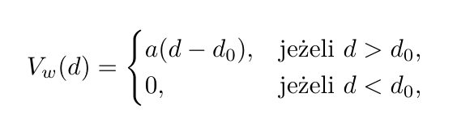

# 0800-fizobl-project2

## Podstawy Fizyki Obliczeniowej (0800-fizobl)

### Projekt II.
### Bartosz Tyrcha

Celem projektu było przeprowadzenie symulacji metadynamiki dla układu składającego się z pojedynczej molekuły NaCl w wodnym roztworze, przy pomocy oprogramowania Lammps oraz PLUMED.

Korzystając z wyników symulacji metadynamiki za pomocą języka Python utworzono wykresy zależności energii swobodnej od odległości pomiędzy atomami Na i Cl w różnych chwilach trwania symulacji. Przedstawia je plik *fes_metad.png*.

Na wspomnianym wykresie można zauważyć, że krzywe energii swobodnej w kolejnych chwilach trwania symulacji układają się coraz bliżej siebie. Świadczy to o zbieżności symulacji.

Wykres energii swobodnej dla chwili końcowej (tj. 10 ns) zawiera dwa minima.
Pierwsze z nich, zlokalizowane około 0,25 nm odpowiada stanowi związanemu molekuły NaCl.
Natomiast drugie, znacznie szersze minimum, zlokalizowane w okolicy 0,5 nm odpowiada stanowi zdysocjowanemu układu.

Widoczny jest również gwałtowny wzrost energii swobodnej dla odległości powyżej 0,6 nm, który nie jest możliwy do powiązania z żadnym fizycznym efektem.
Wynika on z użycia w trakcie symulacji metadynamiki dodatkowego, niefizycznego, potencjału mającego kształt prawego ramienia paraboli, tj.
\
gdzie *d* jest odległością pomiędzy Na i Cl, *d0* = 0,6 nm oraz *a* > 0.
Celem użycia tego potencjału jest ograniczenie przestrzeni próbkowanej przez układ w trakcie symulacji.
Skutkuje to pojawieniem się bariery dla odległości większych niż 0,6 nm na wykresie energii swobodnej.

W celu usunięcia niefizycznego zniekształcenia energii swobodnej wykonano ponowne ważenie (ang. *reweighting*) otrzymanego podczas symulacji profilu energii swobodnej.
Zmodyfikowany wykres energii swobodnej od odległości przedstawia plik *fes_welltempered.png*.
Można zauważyć, że na tym wykresie nie występuje już niefizyczna bariera dla odległości większych niż 0,6 nm. (Za wyjątkiem nagłego wzorstu energii swobodnej w okolicy 0,8 nm. Wynikać, to może ze słabego próbkowania tego obszaru przez układ podczas symulacji, ponieważ dodatkowa bariera była w tym obszarze dość wysoka).
Zatem, można uznać ten profil energii swobodnej za poprawny.

Prównanie energii swobodnej przed oraz po ponownym ważeniu przedstawia plik *fes_comparison.png*.

